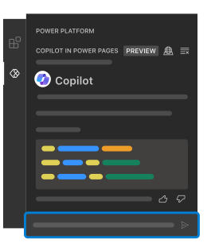

#  Copilot in Power Pages

Copilot in Visual Studio Code helps you code using natural language chat interaction. In Power Pages, you work with site code that includes HTML, JS, or CSS code to make site customizations that are not currently supported in Power Pages low-code design studio. This Copilot chat experience assists Power Pages developers like you to write code by simply describing your expected code behavior using natural language. You can also delve deeper into existing code and learn what it means by using the Explain feature. You can then refine the generated code and use it when customizing your site.



## Prerequisites

Review the [terms](https://go.microsoft.com/fwlink/?linkid=2189520) and [Responsible AI FAQ](https://go.microsoft.com/fwlink/?linkid=2240145) documents to understand usage and limitations of Copilot. Check the following requirements to start using Copilot in Power Pages:

- Ensure you have installed the latest Power Platform Tools extension.
- Open site root folder in Visual Studio Code.

  

- Login to Power Pages Copilot with your Dataverse Environment credentials.

## How to use Copilot to generate code

Copilot in Visual Studio Code is tuned to generate code for Power Pages sites, so its functionalities are limited to Power Pages site supported languages like HTML, JS, and CSS. The generated code from Copilot makes use of supported frameworks like bootstrap and jQuery.

1. In the Copilot chat, describe the code behavior you want using natural language. For example, code for form validation or Ajax calls using the Power Pages Web API.
1. Continue to rephrase your questions in the Copilot chat and iterate them till you’ve got what you need.
1. Once you are happy with the generated code, you can easily copy and paste the code snippet or insert the code to Power Pages site and modify the code further.
1. Use the **up/down** arrow key to navigate between recently entered prompts.

Examples

- `Write code for Web API to fetch active contacts`
- `Write code in JavaScript to make sure that submitted value for phone number field is in valid format`

Note

- Copilot generated code might not have the correct names for tables or columns, so it’s recommended to verify these details before using the code.
- To generate more accurate code, it is recommended that you open the file where you want to use the code. For example, open a web template for web API or open custom JavaScript file for forms where you want to add field validation.


To know more, see [Copilot in Power Pages documentation](https://go.microsoft.com/fwlink/?linkid=2206366).

## How to use Explain in Copilot to understand code

Copilot's Explain feature is useful for developers who are working on existing code and want to understand it. To use Explain, follow these steps:

Select the lines of code you want to understand from the code editor, right-click to access the in-context menu and then select **Copilot in Power Pages > Explain**. Copilot will record the selected lines of code in the chat panel and provide a response explaining the code to you.

Alternatively, select the lines of code and type ```Explain selected code``` in the Copilot chat panel. You can also directly ask Copilot by adding the code in the prompt. For example, you can ask ```Explain the following code ```.


## Help us in improving this feature

In every response of the Copilot chat, click the feedback options, 👍if you like the response or 👎if you didn’t like it. Your feedback will greatly help improve the capabilities of this feature.


